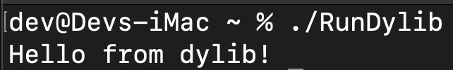

# Dylib_Runner

Simple swift file that can run an on-disk dylib. 

Leveraged code samples at https://stackoverflow.com/questions/34669958/swift-how-to-call-a-c-function-loaded-from-a-dylib.

Steps:
1. In RunDylib.swift edit the `myhandle` variable to include the path to the dylib you want to run.
2. In RunDylib.swift edit the `x` variable to include the name of the function you want to invoke
3. **Note: I have a sleep(3) entry in the RunDylib.swift file that I added to ensure the program had enough time to complete before closing out...feel free to edit that as needed (or remove altogether if preferred)**
4. Save and build with: `swiftc -o [binary_name] RunDylib.swift`
5. Run: `./[binary_name]`

